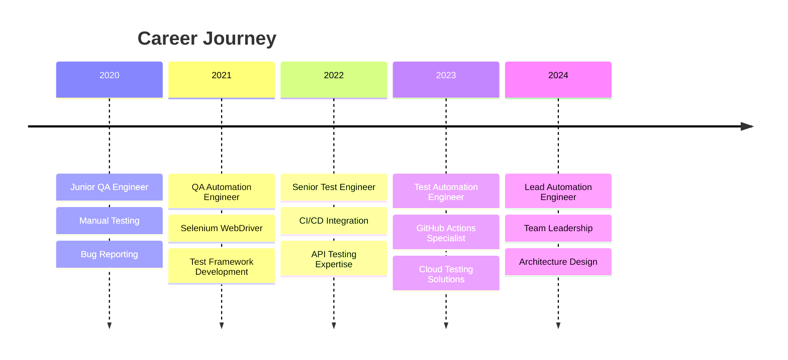

# 🚀 Hi there, I'm Shiar Osman! 

<div align="center">
  
  
  
</div>

---

## 👨‍💻 About Me

```javascript
const shiar = {
    role: "Test Automation Engineer",
    company: "DCI - Digital Career Institute",
    location: "🌍 Remote",
    expertise: ["Test Automation", "GitHub Actions", "CI/CD", "API Testing", "Full Stack Development"],
    languages: ["JavaScript", "Python", "TypeScript", "Java", "PHP"],
    frameworks: ["Jest", "Selenium", "Cypress", "Playwright", "Postman", "React", "React Native"],
    cloud: ["GitHub Actions", "AWS", "Docker", "Azure", "Apache"],
    mobile: ["React Native", "Expo CLI", "Mobile Test Automation"],
    systems: ["Linux", "Apache", "Docker", "CI/CD"],
    databases: ["MongoDB", "PostgreSQL", "MySQL"],
    currentFocus: "Building robust automation frameworks and CI/CD pipelines",
    funFact: "I automate everything that can be automated! 🤖"
};
```

---

## 🔥 Skills & Technologies

### 🧪 Test Automation


### 🚀 Automation Frameworks


### 🌐 Frontend & Mobile Development


### ⚡ CI/CD & DevOps


### 🖥️ Systems & Infrastructure


### 🗄️ Databases & Tools


---

## 📊 GitHub Statistics

<div align="center">
  
  
  
  
  
  
  
</div>

---

## 🏆 GitHub Achievements

<div align="center">
  
  
  
</div>

---

## 🔥 Contribution Graph

<div align="center">
  
  
  
</div>

---

## 🚀 Featured Projects


### 🎯 Recent Work Highlights

- 🤖 **GitHub Actions Integration**: Migrated cohort management system from Express.js to serverless GitHub Actions
- ⚡ **API Automation**: Built comprehensive Podio API integration with robust error handling
- 🔄 **CI/CD Pipelines**: Implemented automated testing and deployment workflows
- 📊 **Test Frameworks**: Designed and developed scalable test automation frameworks
- 📱 **Mobile Test Automation**: Developed React Native app testing with Expo CLI integration
- 🐧 **Linux Infrastructure**: Configured Apache servers and automated deployment pipelines
- ☁️ **Azure Cloud Solutions**: Implemented cloud-based testing environments and CI/CD
- 🌐 **Full Stack Testing**: Built end-to-end testing solutions for React and PHP applications

---

## 💼 Professional Experience



---

## 🎓 Certifications & Learning


---

## 📈 Coding Activity

<!--START_SECTION:waka-->
```text
JavaScript   10 hrs 45 mins  ██████████▓░░░░░░   42.8%
React        4 hrs 30 mins   ████▒░░░░░░░░░░░░   17.9%
TypeScript   3 hrs 15 mins   ███▒░░░░░░░░░░░░░   12.9%
PHP          2 hrs 50 mins   ██▓░░░░░░░░░░░░░░   11.3%
Python       2 hrs 10 mins   ██░░░░░░░░░░░░░░░    8.6%
YAML         1 hr 40 mins    █▓░░░░░░░░░░░░░░░    6.5%
```
<!--END_SECTION:waka-->

---

## 🌟 Fun Facts & Interests

- 🎯 **Automation Enthusiast**: If it can be automated, I'll find a way!
- 🔍 **Bug Hunter**: Love finding and fixing those tricky edge cases
- 📚 **Continuous Learner**: Always exploring new testing tools and methodologies
- 🌍 **Open Source Contributor**: Passionate about giving back to the community
- ☕ **Coffee Powered**: My code runs on caffeine and clean architecture
- 📱 **Mobile Development**: Building cross-platform apps with React Native and Expo
- 🐧 **Linux Enthusiast**: Daily driver and server administration expert
- 🌐 **Full Stack Mindset**: From frontend React to backend PHP, I test it all!

---

## 📫 Let's Connect!

<div align="center">

[]([https://linkedin.com/in/your-profile](https://www.linkedin.com/in/shiar-o-558844150/))
[](mailto:git@shiar.de)
[](https://shiar.de)

</div>

---

## 💡 Philosophy

> "Quality is not an act, it is a habit. Automation is not a goal, it's a journey." - Shiar Osman

<div align="center">
  
  
  
</div>

---

## 🎵 Currently Coding To

[](https://open.spotify.com/user/31wtqqxnyyazuvieyn3pxy6egddm)

---

<div align="center">

### 🚀 "Building the future, one test at a time!" 


**Thanks for visiting my profile! Let's build something amazing together! ⭐**

</div>

---

<div align="center">
  
  
  
</div>
